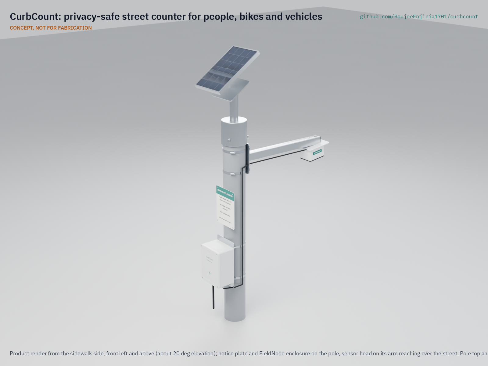

# CurbCount

  

**Area:** Smart Cities · **TRL:** 3 of 9 (proof of concept on paper) · **Prototype budget:** about $275 USD · **Difficulty:** 3 of 5

A privacy-safe counter for people, bicycles and vehicles at street level that uses on-device detection and sends only counts, never images.

[Exploded render](media/render-exploded.png) · [Detail render](media/render-detail.png) · [Interactive 3D model](media/viewer.html) · [Concept blueprint (PDF)](media/concept-blueprint.pdf) · [General arrangement (PDF)](cad/drawings/CBC-DWG-001.pdf) · [Calculations](docs/04-calcs/01-sizing.md) · [Review note](docs/REVIEW.md)

## Concept rationale

Counts without images give planners evidence while respecting residents. CurbCount uses a 32 x 24 pixel thermal array instead of a camera: from 4.3 m up it images a person's head at about 7.6 pixels per meter (8.5 for a 2 m person) and a number plate at under 2 pixels, so the sensor cannot capture a face or a plate even if its firmware were changed. The FieldNode core's own processor turns heat blobs into counts of people, cyclists and vehicles by direction, and only 15-minute counts leave the device.

It is open and garage-buildable because trust is the point. A city, a residents' group or a researcher can read the firmware, inspect the hardware and build their own from off-the-shelf parts, clamped to an existing pole on the lab's shared FieldNode power and radio core.

## Burning platform

Street redesign decisions are contested, and counts of people walking and cycling are usually missing. Road crashes kill about 1.19 million people a year, and more than half are pedestrians, cyclists and motorcyclists; pedestrians alone are 23 % and cyclists 6 % ([WHO, 2023](https://www.who.int/news/item/13-12-2023-despite-notable-progress-road-safety-remains-urgent-global-issue)). WHO also reports that 80 % of the world's roads fail to meet pedestrian safety standards (same source), and 92 % of road deaths occur in low- and middle-income countries ([WHO fact sheet](https://www.who.int/news-room/fact-sheets/detail/road-traffic-injuries)).

Fixing streets for people on foot and on bicycles needs evidence of how many use them, before and after a change. Motor traffic is counted routinely; walking and cycling rarely are, and the camera systems that could count them raise privacy concerns that stall deployment. The global goal of at least halving road deaths and injuries by 2030 ([WHO Global status report on road safety 2023](https://www.who.int/publications/i/item/9789240086517)) leaves little time.

## Where it could be used

### By industry

| Industry | Use |
| --- | --- |
| Municipal transport planning | Before and after counts for new bike lanes, wider sidewalks and school streets |
| Road safety engineering | Pedestrian and cyclist exposure at crossings, to turn crash counts into risk rates (with CrossSafe) |
| Retail and business districts | Footfall by hour and day on high streets and markets |
| Parks, trails and tourism | Use of promenades, greenways and trail heads without cameras |
| Transit operators | Walking and cycling flows on station access routes |
| Research and education | Open, reproducible active travel counts for universities and schools |

### By country or region

| Country or region | Why it matters there |
| --- | --- |
| Sub-Saharan Africa | More than a billion people in Africa walk or cycle every day, about 56 minutes a day against a global average of about 44 minutes, yet most countries lack policies and budgets for them ([UNEP](https://www.unep.org/resources/report/walking-and-cycling-africa-evidence-and-good-practice-inspire-action)) |
| India | Road crashes took about 300,000 lives in 2016, and most of those dying are pedestrians, cyclists and motorcyclists ([WHO India](https://www.who.int/india/health-topics/road-safety)) |
| Latin America and the Caribbean | In the Americas, motorcyclists, pedestrians and cyclists rose from 39 % to 47 % of road deaths between 2009 and 2021 ([PAHO](https://www.paho.org/en/topics/road-safety)) |
| United States | 7,522 pedestrians were killed in 2022, 18 % of all traffic deaths ([NHTSA](https://crashstats.nhtsa.dot.gov/Api/Public/ViewPublication/813590)) |
| England | Walking is 29 % of all trips and cycling 2 % ([Department for Transport, 2024](https://www.gov.uk/government/statistics/walking-and-cycling-statistics-england-2023)); councils need counts to justify active travel schemes |
| European Union | Data protection by design is a legal duty ([Regulation (EU) 2016/679, Article 25](https://eur-lex.europa.eu/eli/reg/2016/679/oj); [text of Article 25](https://gdpr-info.eu/art-25-gdpr/)), which favors counters that cannot capture personal data at all |

## What sparked the idea

The idea traces back to Toronto's Quayside waterfront project. In October 2018 Ann Cavoukian, the former Ontario privacy commissioner who wrote the privacy-by-design framework the project had adopted, resigned as its adviser because the proposed data trust could approve collection of data that was not de-identified at source. In her resignation letter she warned that such data would create "another central database of personal information (controlled by whom?)" ([The Globe and Mail, 2018](https://www.theglobeandmail.com/business/article-privacy-expert-ann-cavoukian-resigns-from-sidewalk-toronto-smart-city/)). CurbCount takes the lesson literally: de-identification at source should be a property of the sensor, not a policy promise, so it uses a sensor too coarse to capture a face in the first place.

## Problem

Cities plan streets with little data on walking and cycling, and camera-based counting raises privacy concerns.

## Concept

A privacy-safe counter for people, bicycles and vehicles at street level that uses on-device detection and sends only counts, never images.

A thermal array on a short arm looks down over the sidewalk, bike lane and nearest traffic lane; a standard FieldNode core (one LiFePO4 cell, 6 W panel) reads the array, tracks heat blobs in fixed-point firmware on its STM32WL, counts them by class and direction, and sends a 10-byte record every 15 minutes over LoRaWAN to TwinKit or any LoRaWAN server. The TRL 3 calculations ([CBC-CAL-001](docs/04-calcs/01-sizing.md)) give 0.10 W average from the cell, 6.2 days of counting without sun, a footprint 12.8 m across the street and 6 to 7 m along it, which covers a 3 m sidewalk, a 2 m bike lane and the nearest lane, 4.4 kg on the pole and $253.00 in parts against the $275 budget. No requirement is unmet on paper; three are at risk: counting fast cars (4.2 frames at 50 km/h), people walking close together, and counting on sunlit pavement. The thermal build is for temperate sites; a hot-climate city would use a radar variant. See the [requirements](docs/03-requirements.md) and the [decision record](docs/decisions/0002-recommendations-accepted.md).

Full design precis: [docs/02-concept.md](docs/02-concept.md)

## Key components

- Low-resolution thermal array (32 x 24 px, 110 x 75° lens, wide axis across the street) behind an HDPE window; mmWave radar as the hot-climate variant
- FieldNode power and radio core, standard: one LiFePO4 cell, 6 W panel, STM32WL running the tracker (an ESP32-S3 head is kept on paper as a fallback)
- Aluminum sensor arm, pole-top panel mount and stainless band clamps
- Public notice plate on the pole

The priced bill of materials is in [bom/bom.csv](bom/bom.csv); the parametric model is [cad/src/model.py](cad/src/model.py).

## Safety

> Privacy by design: no images, audio recordings or personal identifiers leave the device; only aggregate counts or levels are stored. Check local data protection law before any deployment. Street furniture and pole mounts must be installed only with the asset owner's permission, by trained crews, with fall protection and traffic management as local rules require.
>
> The node contains a LiFePO4 cell: keep it fused and charge only within the cell maker's temperature limits. Fit safety lanyards to the panel and sensor head so nothing can fall on people below.

## Repository layout

| Folder | Contents |
| --- | --- |
| `docs/` | Problem, concept, requirements, calculations and design decisions |
| `cad/src/` | build123d Python source, the source of truth for all geometry |
| `cad/step/`, `cad/stl/` | Exported models for FreeCAD, other CAD tools and printing |
| `cad/drawings/` | 2D sketches and dimensioned drawings |
| `bom/` | Bill of materials |
| `electronics/` | KiCad schematics and PCB layouts |
| `firmware/` | Microcontroller code |
| `media/` | Renders, perspectives and photos |
| `build-log/` | Dated prototyping notes |

## Documentation

Controlled documents follow the portfolio [documentation standard](.kit/STANDARDS.md). Each carries a document ID (CBC-PRC-001 for the precis), a version and a revision history. Branded PDFs are built with `python .kit/render.py` and attached to GitHub Releases when a document is tagged, for example `CBC-PRC-001/v1.0`.

## Credits

Designed by Amish Chadha. See [CONTRIBUTORS.md](CONTRIBUTORS.md) for roles. To cite this design, use [CITATION.cff](CITATION.cff) (GitHub shows it as "Cite this repository").

AI assistance (Claude) was used to accelerate concept renders, prototype documentation and first-pass sizing calculations. Design direction and all decisions are Amish Chadha's, recorded in this repository's decision records (`docs/decisions/`).

## Licenses

- **Hardware** (CAD, drawings, BOM, electronics): [CERN-OHL-S v2](LICENSE)
- **Software** (firmware, scripts, notebooks): [MIT](LICENSE-SOFTWARE)

A project of the [Design Molecule](https://designmolecule.com) lab.
