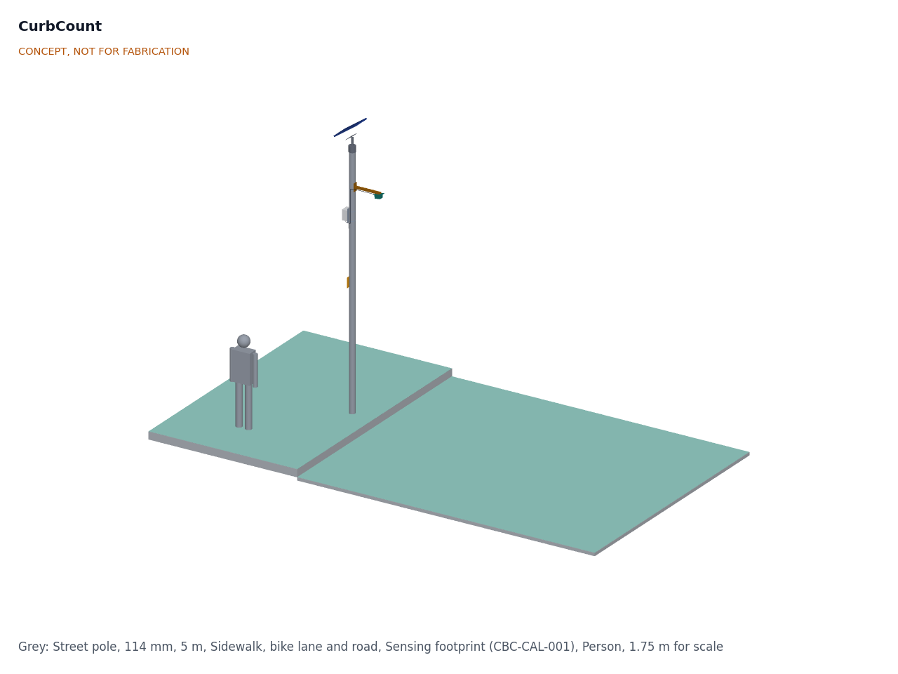
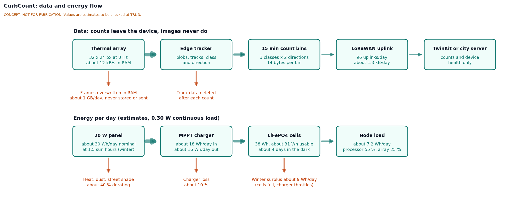
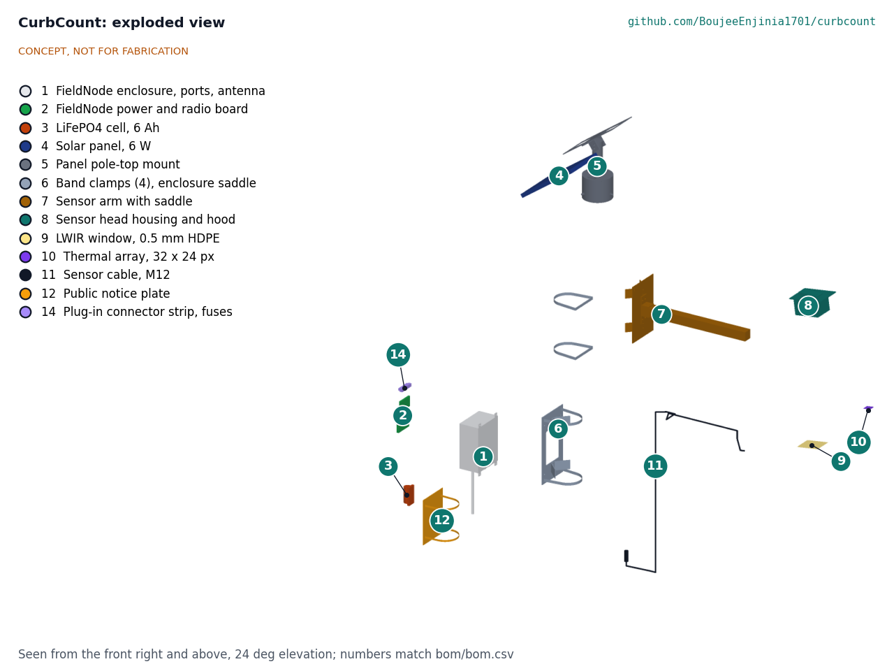
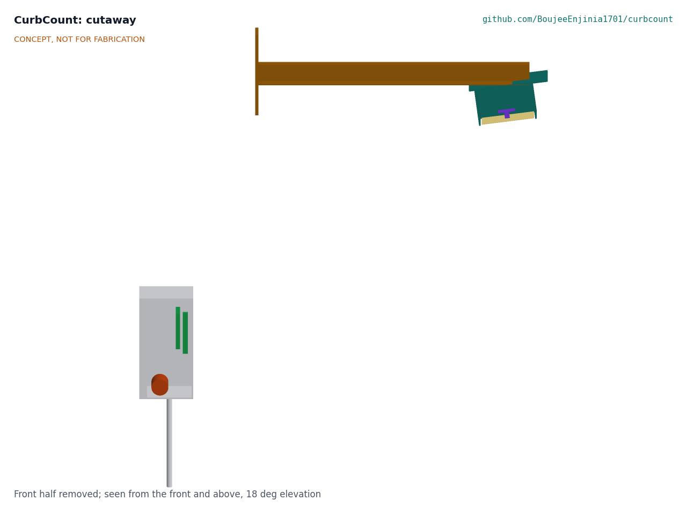

# CurbCount design precis

CurbCount is a clamp-on street pole counter. A 32 x 24 pixel thermal array looks down from 4.3 m over the sidewalk, bike lane and nearest traffic lane; FieldNode's STM32WL turns the heat blobs into counts of people, cyclists and vehicles by direction and sends only 15-minute counts over LoRaWAN. The sensor images a person's head at 7.6 px/m (8.5 px/m for a 2.0 m person), far below what is needed to recognize anyone, so privacy does not depend on the firmware. The calculations in CBC-CAL-001 v0.4 show that on standard FieldNode power (one cell, 6 W panel) it can count for 6.2 days without sun and stay energy neutral in winter, weighs 5.26 kg on the pole and costs an estimated $274.00 in parts against the $275 value-engineering target. A thermal-only counter goes blind for much of a hot day, so this build is for temperate sites; hot-climate sites use the radar variant (CBC-DDR-002).

## How it works

1. **Sense.** The thermal array reads 32 x 24 temperatures in two chess-pattern subpages, 16 a second, giving 8 full frames a second. Its 110 degree axis spans the street. People, cyclists and engines stand out from the pavement as warm (or, on hot pavement, cool) blobs.
2. **Track.** FieldNode's STM32WL reads the array over I²C through the M12 cable and, in fixed-point firmware, keeps a slowly updated background, subtracts it, finds blobs and follows each blob across frames. Frames live only in RAM and are overwritten every 125 ms.
3. **Classify.** Each finished track is classed as pedestrian, cyclist (including e-scooters and other micromobility) or motor vehicle from its size, speed and zone (sidewalk, bike lane or nearest lane), and given a direction along the street. The far part of the road is masked.
4. **Count.** Tracks increment six counters (three classes by two directions); the track data is then deleted. Every 15 minutes the counters close as one 10-byte record (six 12-bit counters and a status byte), small enough for US915 DR0.
5. **Send.** The FieldNode core sends each record over LoRaWAN to the lab's TwinKit gateway, a city server or The Things Network, with a daily health message (battery, temperature, frame errors).

## Main components

Table 1. Main components. Numbers match the exploded view (Figure 3), `bom/bom.csv` and `cad/src/model.py`.

| # | Component | Choice | Notes |
| --- | --- | --- | --- |
| 1 | FieldNode enclosure with ports and antenna | IP65 polycarbonate, 150 x 90 x 200 mm on four lugs, two M12 5-pin ports, two glands, vent and the whip in two rows on the bottom face | FieldNode's constructable core (FND-DDR-003), unchanged |
| 2 | FieldNode power and radio board | MPPT charger with cold-charge lockout, STM32WL-class LoRaWAN module, switched sensor rails; also runs the tracker | From FieldNode, standard charger setting (DDR-002) |
| 3 | LiFePO4 cell | One 3.2 V 6 Ah cell, FieldNode standard | Standard FieldNode power (DDR-002) |
| 4 | Solar panel | 6 W, 290 x 200 mm, 9 V class, FieldNode standard | Standard FieldNode power (DDR-002) |
| 5 | Panel pole-top mount | Aluminium sleeve with set screws over the pole top, cap disc, 42.4 mm post on angle clips, rail plate 290 x 150 mm at 35 degrees; all bolted | Panel bolted through its frame lip (CBC-DDR-003) |
| 6 | Band clamps and enclosure saddle | Four 12 mm stainless bands through slots in the saddle plates, aluminium saddle plate on two bent V-saddles, for 60 to 140 mm poles | No drilling; FieldNode's V-blocks fit only 40 to 60 mm poles |
| 7 | Sensor arm | 40 x 40 x 2 mm aluminium tube, 498 mm, bolted to a saddle plate on V-saddles by two angle brackets; head 530 mm from the pole axis | Keeps the head clear of the pole |
| 8 | Sensor head housing | 3D-printed ASA, 110 x 90 x 70 mm, with a sun hood | View tilted 7.5 degrees toward the road |
| 9 | Window | 0.5 mm HDPE film, about 0.75 transmission at 8 to 14 µm (estimate) | Far cheaper than germanium; to be measured |
| 10 | Thermal array | MLX90640 class, 32 x 24 px, 110 x 75 degree lens, 110 degree axis across the street; read over I²C by the STM32WL | DDR-001 D2; radar is the hot-climate variant (DDR-002) |
| 11 | Sensor cable | M12 5-pin, about 2 m, to a FieldNode sensor port carrying I²C and 3.3 V | Pinout to agree with FieldNode |
| 12 | Public notice plate | 150 x 200 mm aluminium plate at 2.6 m | DDR-001 D7 |

The separate ESP32-S3 edge processor of v0.3 is removed (DDR-002). It stays on paper as a fallback, with FieldNode's high-load power variant (a second cell and a 20 W panel), if bench profiling at TRL 4 shows the STM32WL cannot run the tracker. The calibration jumper (DDR-001 D6) moves to FieldNode's service header; its link is in the hardware set, BOM line 13.

The parametric model is `cad/src/model.py` (STEP and STL in `cad/step/` and `cad/stl/`), and the general arrangement is drawing [CBC-DWG-001](../cad/drawings/CBC-DWG-001.pdf). Every part can be made in a small workshop and every joint is bolted (design for construction, CBC-DDR-003); the illustrated [prototype build plan](05-build-plan.md) (CBC-BLD-001) shows how, and open decisions are in the [design decisions register](06-design-decisions.md).

## Key numbers

Table 2. Key numbers from CBC-CAL-001 v0.4. Tags refer to lines of `docs/04-calcs/sizing.py` output.

| Quantity | Value | Requirement |
| --- | --- | --- |
| Footprint across the street | 4.45 m behind the curb to 8.34 m into the road [A2] | R6 met on paper |
| Footprint along the street | 5.71 to 7.28 m [A5] | |
| Resolution at head height | 7.6 px/m (1.75 m person), 8.5 px/m (2.0 m) [B2] | R4 met on paper |
| Frames per crossing | 30 for pedestrians, 7.7 for cyclists at 25 km/h, 4.2 for cars at 50 km/h [C1] | R1 at risk |
| Hours below detection contrast, mild day | 10.2 h sunlit, 3.2 h with track averaging, 0 h shaded [D5] | R7 at risk (temperate sites) |
| Load from the cell | 103 mW average, 2.47 Wh/day [E1] | 92 % of FieldNode's proposed 100 mW allowance |
| Autonomy | 6.22 days; 4.36 days at -20 °C [E2] | R8 met on paper |
| Winter harvest, 6 W | 4.4 Wh/day, 1.77 times the draw [E3] | R9 met on paper |
| Uplink | 10 bytes per 15 min; 206 ms at SF9, 0.82 s/h; 371 ms at US915 DR0 [G1, G2] | R5 met; R15 met on paper |
| Wind on panel | 52 N at 35 m/s; post factor 55 [H1] | R12 |
| Mass on the pole | 5.26 kg [H5] | R11 met on paper |
| Parts cost | $274.00 estimated against the $275 value-engineering target [J1] | R13 within the value-engineering target ($1.00 under) |

Counts will still run low where parked vans, trees and awnings hide the footprint, and where people walk side by side.

## Key design choices

All choices below were decided by Amish on 2026-09-25 (CBC-DDR-001 and CBC-DDR-002).

- **Thermal array rather than a camera.** At 32 x 24 pixels the sensor cannot capture an identifiable image at the mounting height used here, so privacy does not depend on trusting the firmware.
- **Thermal build for temperate sites, 60 GHz radar for hot climates.** Without the radar variant the counter does not work in hot weather (CBC-CAL-001 section D). The radar variant is brought forward for any hot partner city; no partner city has been chosen.
- **Array turned so its wide axis spans the street.** It covers the full design case (R6) at the cost of fewer frames per fast vehicle (R1).
- **Frames never leave RAM.** The firmware has no code path that writes or sends a frame. A calibration mode shows frames on a laptop only through a physical jumper on FieldNode's service header, never over the radio.
- **Tracking on FieldNode's STM32WL, on standard FieldNode power.** Fixed-point tracking brings the head to 92 mW, inside FieldNode's allowance, so one cell and the 6 W panel suffice. The ESP32-S3 head on FieldNode's high-load variant is the fallback.
- **15-minute bins, three classes by two directions, in a 10-byte record.**
- **Public notice plate on every pole.**

## Safety

> **Safety:** Installing on a street pole is work at height next to traffic. Install only with the pole owner's permission, by trained crews, with fall protection and traffic management as local rules require. Keep clear of overhead power lines and street-light wiring, and never open a pole's electrical hatch. The pole owner must check that the pole can carry the extra 52 N wind load at 5.3 m.

> **Safety:** The node contains one LiFePO4 cell, about 19 Wh. Keep its fuse, charge only within the cell maker's temperature limits (FieldNode's cold- and hot-charge lockout applies), and do not install a node with a swollen or damaged cell. The ESP32-S3 fallback would add a second cell and a 20 W panel that can deliver 5 A; that variant needs its own fusing and charger setting.

> **Safety:** A falling part from 4 to 5.5 m can injure people below. Use a secondary safety lanyard on the panel and the sensor head, torque the sleeve set screws and bands, and check clamps after the first storm.

**Privacy.** No images, audio recordings or personal identifiers leave the device; only aggregate counts are stored or sent. Any change to a higher-resolution sensor needs a fresh privacy review. Check local data protection law before any deployment, and fit the notice plate saying what is counted, that no images are stored or sent and only counts leave the device, and where the design is documented.

## Open questions

- Measure HDPE window transmission at 8 to 14 µm and the MLX90640 noise at 16 Hz (TRL 4, on hold).
- Profile the fixed-point tracker on the STM32WL and check I²C over the 2 m cable on a street pole (TRL 4, on hold).
- Define the tracker for merged blobs (groups, parents with strollers) and the target accuracy per class.
- Agree the M12 pinout, the calibration jumper and the 60 to 140 mm pole saddle with the FieldNode project. CurbCount's position, decided by Amish on 2026-10-02 (CBC-DEC-001, item 3): one common pin order for both ports (supply, ground, I2C data, I2C clock, spare), each port's supply set by a per-project supply module (switched 3.3 V on port A here), and the jumper sensed on FieldNode's service header.
- Find a side-arm panel mount for poles whose top carries a lantern (suggestion).
- First co-design partner (decided by Amish, 2026-10-02): a city transport department that already runs counts on a street with a bike lane, first trial in a season with air under 20 °C; the first candidate to approach is the City of Toronto's transportation services. A hot partner city or a summer pilot would bring the radar variant forward.

Concept media: [blueprint sheet](../media/concept-blueprint.pdf), [interactive 3D model](../media/viewer.html).
